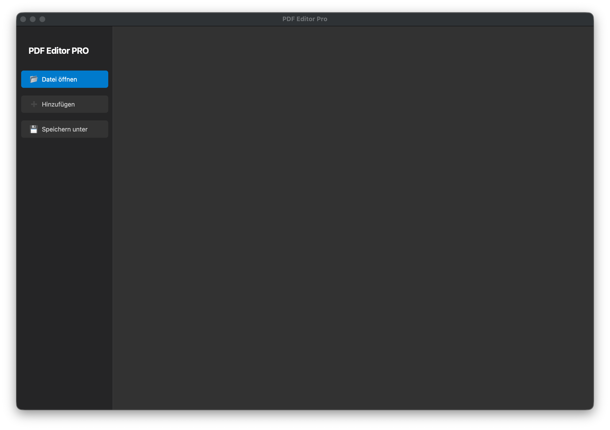

### Quick Start Guide:
1.  **📂 Open File**: Load a PDF document.
2.  **➕ Add More**: Append additional PDFs to your current project.
3.  **Reorder**: Use the arrows on the page cards to adjust the document structure.
4.  **💾 Save As**: Export your newly arranged document as a new PDF.

## 📦 Dependencies

This app leverages the power of:
*   [PySide6](https://doc.qt.io/qtforpython-6/) (Qt for Python) – UI Framework.
*   [PyMuPDF (fitz)](https://pymupdf.readthedocs.io/) – Blazing fast page thumbnail rendering.
*   [PyPDF2](https://pypdf2.readthedocs.io/) – PDF structure manipulation (Merging/Saving).

## 📄 License

This project is licensed under the **Apache License 2.0**.

Copyright © 2026 gradwohlandco

Licensed under the Apache License, Version 2.0 (the "License"); you may not use this file except in compliance with the License. You may obtain a copy of theHere is the complete **README.md** in English, tailored for your GitHub repository and updated with the new name.

---

# PDF Editor Pro 🚀

A modern, lightweight PDF editor built with **Python**, **PySide6**, and **PyMuPDF**. This application allows you to manage PDF documents intuitively—reordering, merging, or deleting pages—all wrapped in a sleek dark-mode interface that looks great on Windows 11, macOS, and Linux.



## ✨ Features

*   **Load & Merge PDFs:** Open existing documents or combine multiple PDFs into a single file.
*   **Visual Editing:** All pages are displayed as thumbnails in a clean, organized grid layout.
*   **Intuitive Sorting:** Move pages forward or backward using simple control buttons (**◀ / ▶**).
*   **Page Management:** Remove individual pages from the document with a single click (**🗑**).
*   **Cross-Platform:** Consistent look and feel across Windows, macOS, and Linux using the Qt Fusion style.
*   **Modern UI:** A professional dark sidebar-based design for an efficient workflow.

## 🛠 Installation

Ensure you have Python 3.8 or higher installed.

1.  **Clone the Repository:**
    ```bash
    git clone https://github.com/gradwohlandco/pdf-editor-pro.git
    cd pdf-editor-pro
    ```

2.  **Install Dependencies:**
    ```bash
    pip install PySide6 pymupdf PyPDF2
    ```

## 🚀 Usage

Run the application via the terminal:
```bash
python main.py